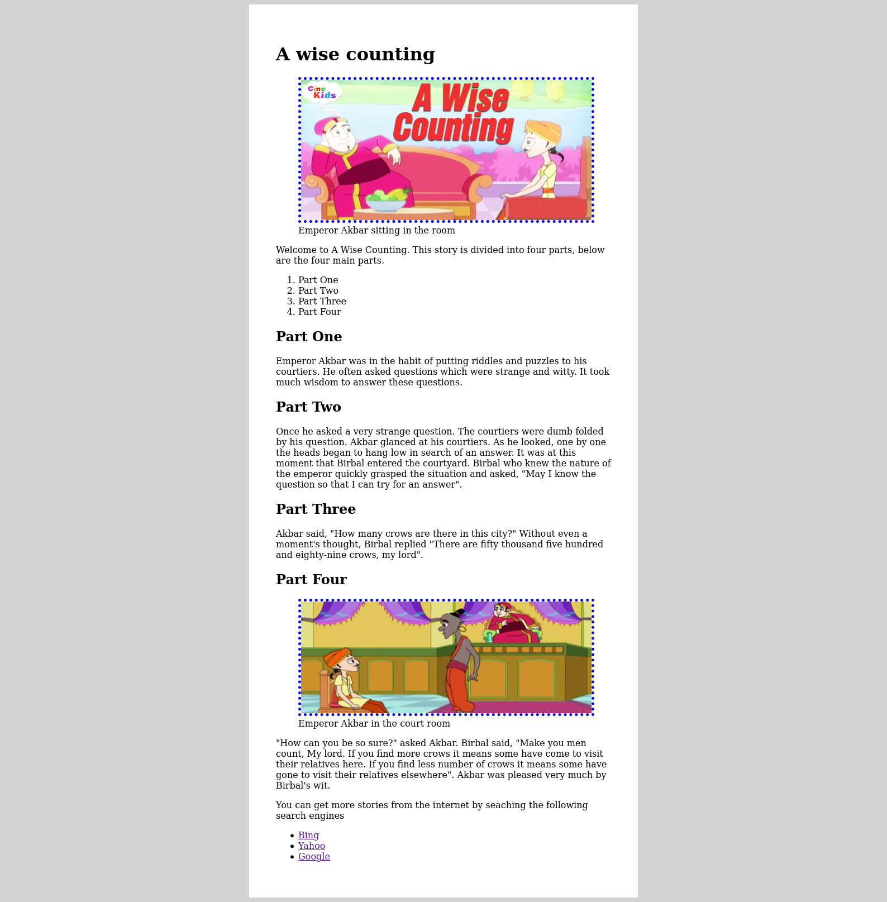

# Assignment - Story Page

In this assignment, you are to code a story page. Here is the design of the page. Study the design carefully and produce it into HTML and CSS.

## Assets

The material/s (images and text content) needed for this task are in the assets folder found within this folder.

- Copy the images from the assets folder and paste them into your images folder created in the story-page.
- Use to text content in the MS word doc to save you from typing every content.

**Note**: Don't forget to re-use the starter boilerplate. Copy and paste it, then renamed the copy to **story-page**, open it via VS Code and start hacking.

