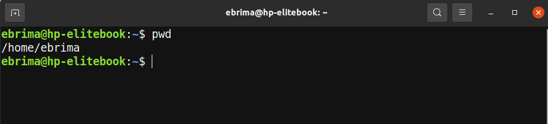
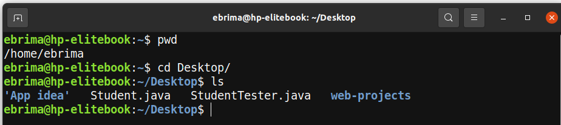
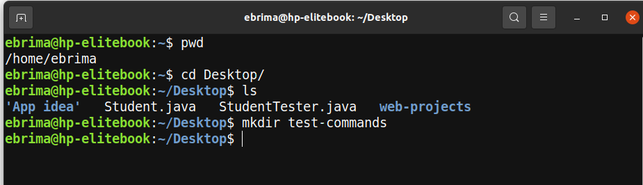
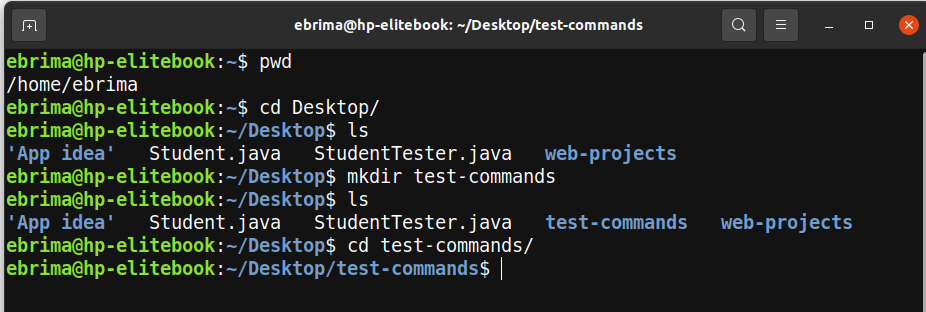
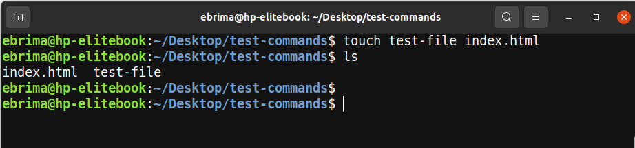
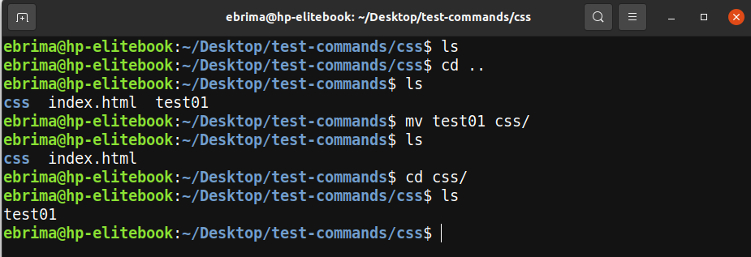
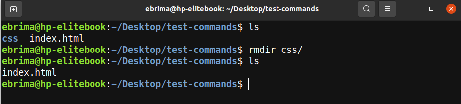
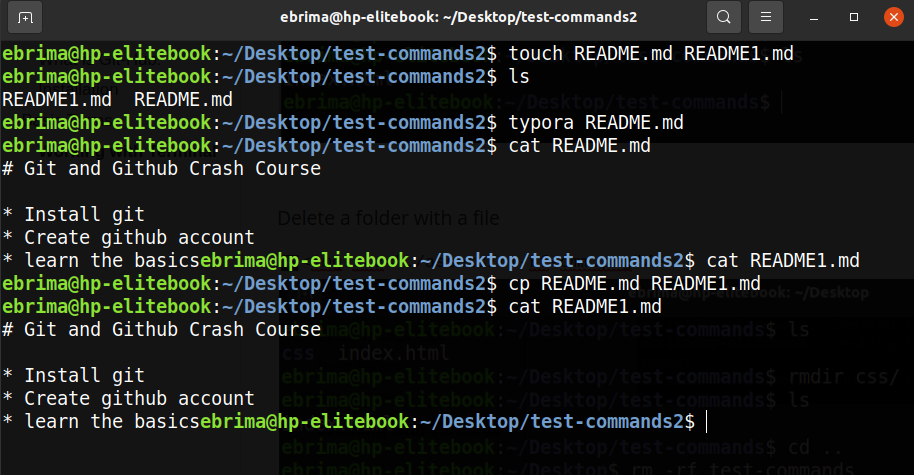
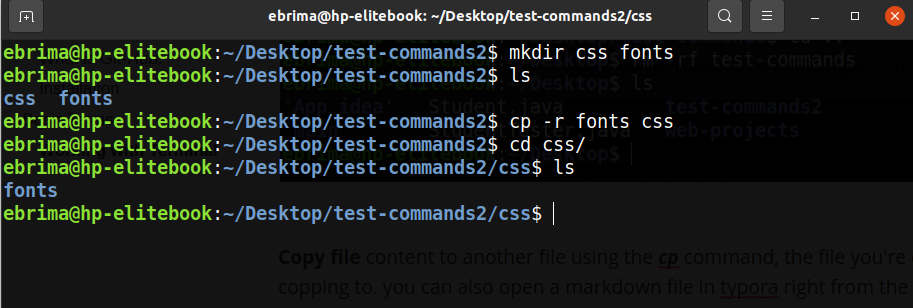

# Command Line Basics

The *command line* is a text interface for your computer. It's a program that takes in *commands*, which it passes on to the computer's operating system to run. From the *command line*, you can navigate through files and folders on your computer, just as you would with Windows Explorer Or your file Explore.


### Working with Terminal:

The terminal will speed up your dev work flow. You can do almost the same task in the terminal your GUI enables, you can create a file, add contents to a file, delete a file, copy and move a file and also you can create a folder and do all the files operations. 

### some basics commands:

1. Present working directory 
2. List directory
3. How to create a folder
4. How to create a file
5. How to navigate between files and folders
6. How copy and move files within folders
7. How to delete a file or a folder


**Present working directory (pdw)**. This show the your current location in the terminal

```bash
pwd
```




**List directory (ls)** this will show you file structure, files and folders

```bash
ls
```





**Create a new folder**. ***mkdir*** is command & folder name is *test-commands*

```bash
mkdir folder-name
```





**Change directory**. ***cd*** is the command and *test-commands/* is the path to navigate to and ***cd ..*** will roll you back

```bash
cd folder-name
```





**Create a new file**. ***touch*** is the command *test-file* & *index.html* are file 

```bash
touch file-name
```





**Move file from one location to another**. ***mv*** is the command *test01* is the file *css/* is the destination

```bash
mv file-name folder-name
```





**Remove or Delete** a folder rmdir is the command 

```bash
rmdir file-name
```





**Delete a folder with a file**

```bash
rm -rf folder-name
```


**Copy file** content to another file using the ***cp*** command, the file you're copping from and the file you're copping to. you can also open a markdown file in typora right from the terminal ***typora README.md*** and the ***cat*** command can help you to view a file with textual content in the terminal

```bash
cp file-copying-from file-copying-to
```





**Copy a folder** in to a folder using ***cp and -r*** command, folder you copping and the folder you copping

```bash
cp -r file-name folder-name
```





### Credits

[Linux Commands HandBook by Flavio Copes](https://www.freecodecamp.org/news/the-linux-commands-handbook/)

