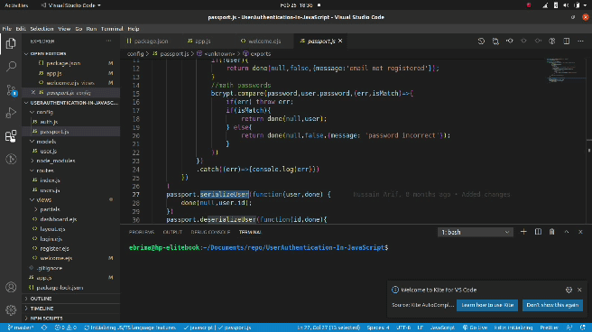

# Setting up Git

These section will show the how set up dev environment to able to work with git.


[TOC]

## Setups

* Install git
* Install Typora
* Install git extensions for VS Code
* Create a github account


### Git Installation

First thing you need to do is to install in your machine, irrespective of your operating system you can still have git because it available for the major operating systems. 

#### Windows Installation

You need to visit git [Download git for windows](www.git-scm.com) page and download git which able you add Bash command tool that will able you write git commands on your PC, because power-shell on windows is not well integrated for writing git commands. While installing git in your system for purpose of these course we will recommend you to leave everything as default.  After you successfully install git tap your start menu and type git bash and open the Git-bash command line interface and type **git** **--version** this will show you the current version of git.

#### Mac Os Installation

Mac has a package manager called [homebrew](www.homebrew.com) which dose the wavy lifting for you and you need to install home-brew first if you don't install it. Mac is a UNIX base OS which means it has the Bash command line tool by default. After successfully installing home-brew:

```bash
// type in your terminal
 brew install git
//verify if git is install and this should show you the current version of git
git --version
```


#### Linux Installation

You probably don't need that much. Linux is also a Unix base OS which means it has the Bash command line tool by default. Open your terminal and type the following:

```bash
// first update your system
sudo apt-get update
// install git
sudo apt-get install git
//verify if git is install and this should show you the current version of git
get --version
```


After successfully installing git in your operating system we also need to have Visual Studio Code running in your machine and with some extensions:


### Install Typora

Visit [typora home page](typora.io)  and download for operating system.

Operating systems like mac and linux you can install typora using a command

**Mac**

```bash
brew install typora
```

  **Linux**

```bash
sudo apt-get update
// after
sudo apt-get install typora
```


### Install Git Extension 

Here in this course we will be using Visual studio Code as our text editor. So on that note will install some git extension that will speedup our work flow as far as git is concern.

Some extensions to install:

1. git project manager
2. git lens
3. git history 

Type one after the other and install  see demo:

 

​      


### Create a Github Account

Visit [github](www.github.com) and create a account and make sure you verify your email


### Credits

[Traversy Media - Git and Github Crash Course](https://www.youtube.com/watch?v=SWYqp7iY_Tc&t=314s)

