# Git Basic

In these section we will take a dip dive and explore more about git and github, we are going get our hands dirty and write some commands. In the previous  sections we discussed some basics concept of git and github, so provided we have git installed, Typora, git extensions and also sign up with github. We are good go!

[TOC]

## Working With Git Remotely

We are going to start with git by initializing a empty folder in our local machine and later go to git and also create git repository on the could and link these two. Sounds confusing? just stay with me soon. 

Create an empty folder or even a folder with files or sub folders. All you need is to initialize git and get the status your folder whether it  is a git repository or not. There are command which helps us to check.

**Some Git Commands**:

* git init
* git status
* git remote
* git add 
* git commit 
* git push

### Create Remote Repository

**Create new Repository** (repo) is just a fancy way git-hub would refers to as a folder in our computer system, to create a repo on git-hub is like creating a remote folder in the could which you can add files or even sub folders to it and you also the power to make it public or private. private means you are the only one who can see and interact or the ones you give permission to and  public means anyone can see and have access to it. See the green button called new if your in github home page or on the far right on the nav bar there is plus icon with a drop down. If you click on create new repository a page will appear were you will fill the name of your repository which is a most and all are just optional but if you want to clone it down then you most check ✅ on Add a READMe which enables and that focus here. 

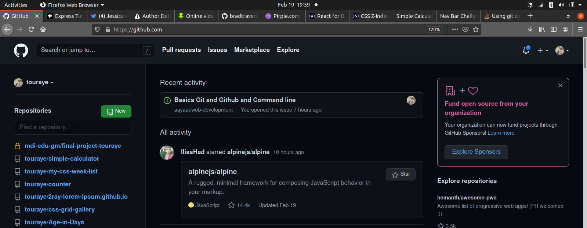


**Clone** is to have the instance of a remote repository (rope) on git-hub into your local machine just like how you would download a file from the Internet. Click on the green code button and copy the link. see the demo below:


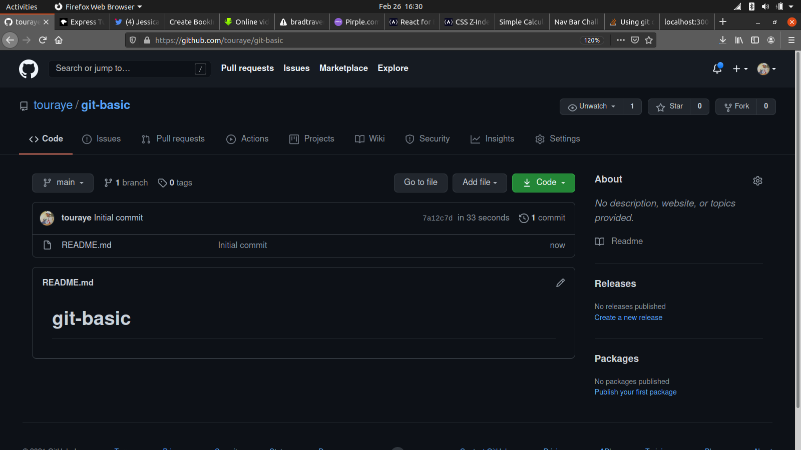


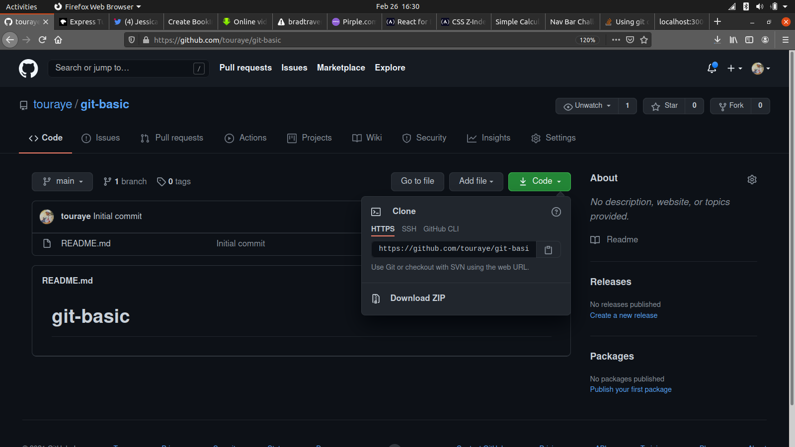


After coping the link open you terminal write **git clone**  and paste [HTTPS ADDRESS]. make sure you're siting in the directory were you want to clone. See in my case i created a new directory and navigate to that directory and  hit on ENTER this will clone down the repo i created on git into my local computer.  You see a success message when everything went OK else a fatal error 

```bash
git clone https://github.com/touraye/git-basic.git
```


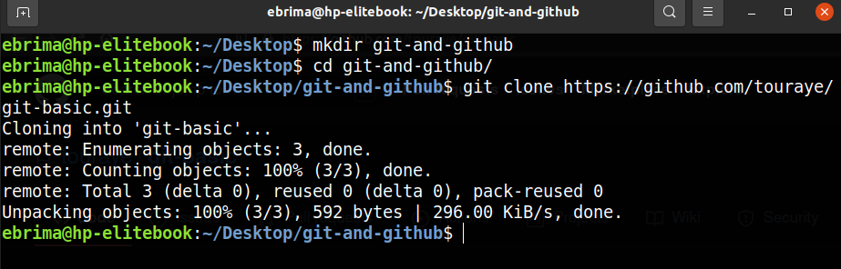


Now **cd** into git-and-github directory, run **ls** command to see the content and run another command **code .** these will opne vS code with your repo just cloned. See below:

```bash
code .
```


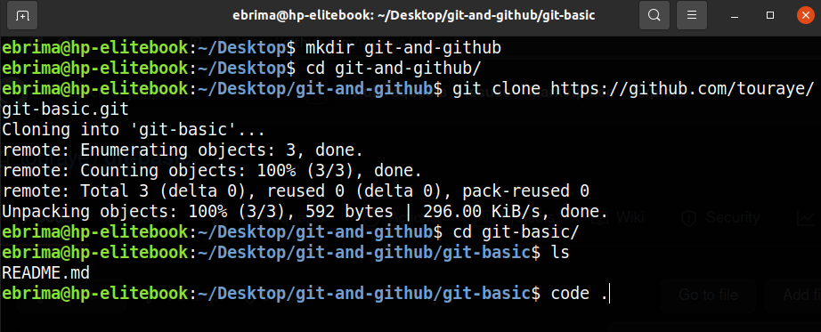


The first look of VS Code is just like these. The only file you see a README.md file if you could remember we checked the input field of added README file while creating a repo on github.

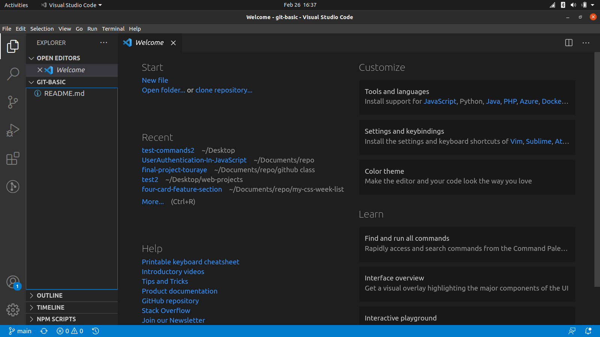


We are will create our first file, and its going to be a html file see blow:

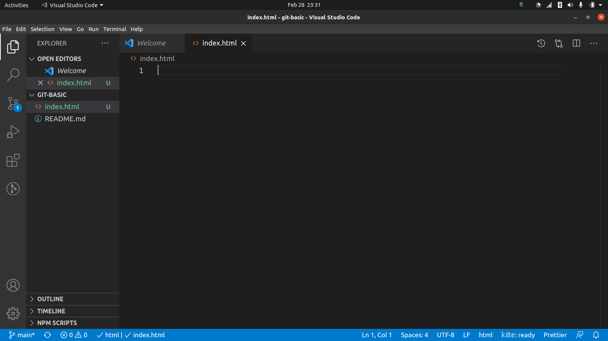


Now is time to get our hands dirty. We are going to create index.hmtl file, generate our boiler plate and add contents to it, add our changes, commit and finally we push our codes back to github. Note, our source control tab has show us a notification, it show 1 which means git track one change to our file and because we added a html file.


See in the screen-shot below where highlighted blue, the + icon is the add or stage button that we will be using. Clicking the + icon will add the changes we made earlier which was the html file we created.

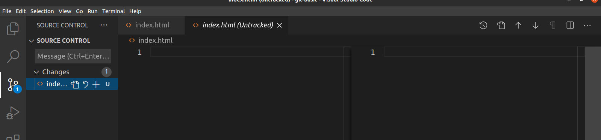


After adding/stage our changes is a good time to make our first commit and this one very simple and precises.  See input field below i have write our first commit message `initial commit`

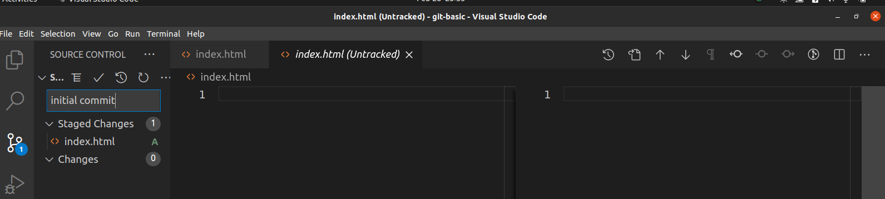

Generate a boiler plate with the short-cut of shift+1 and enter. 

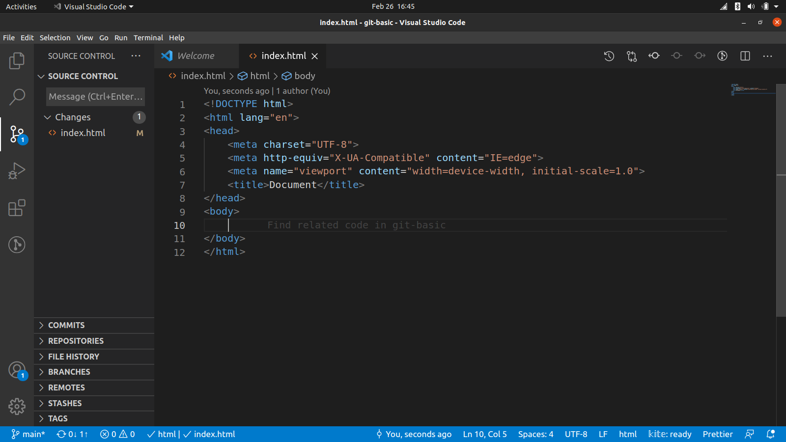


Added some contents to our git repo it could be a full website but here is just a heading 1, paragraph and an anchor tag or a tag 

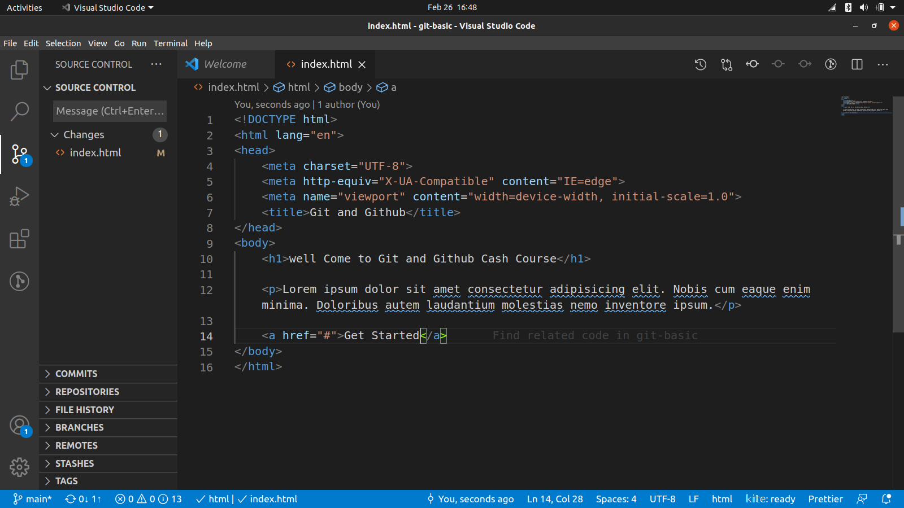


After putting in all we needed we also add/stage our changes and write a commit message `added mark up`and push our code on github. See the purple shaped in it there are two important things we should observe the first one is the 🔁 which is the icon to push and the other ones are the  ￬ 0 and  ￪ 1 which indications of the amount of changes we made. If you click on the push icon it will prompt you for confirmation tap OK and wait if all went fine the  ￬ 0 and  ￪ 1 will disappear.

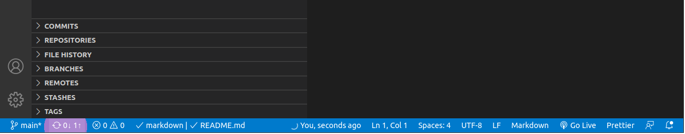


Go to github and to your repo open the index.html file you should see exactly the same content you just added.

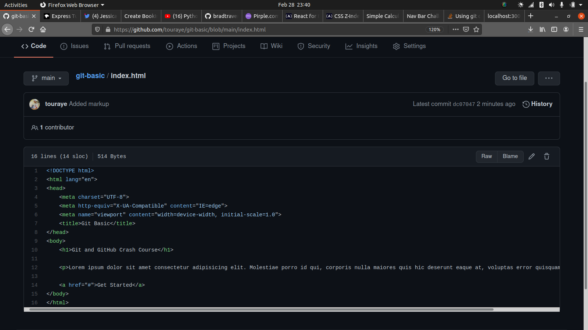


### Create a Local Repository

We can also turn our normal folder in our  computer into a git repository. This could be an empty folder or folder with files  and sub-folders. Here we will be interacting with both VS Code and the terminal. 

See the picture, git1 before been initialized  and after initializing it.  `git status` is the command to check whether a folder in your local machine is a git repo or not and `git init` also is a command that initialized a folder in your computer to be git repo.  `git status` on an uninitialized folder you will received a fatal error see in the picture, but `git status` on a git repo you will a success message of On branch master...

Git status allow us to check the status our a folder whether it is a git repo or not.

```bash
git status
```

Git init initialize a git repo 

```bash
git init
```


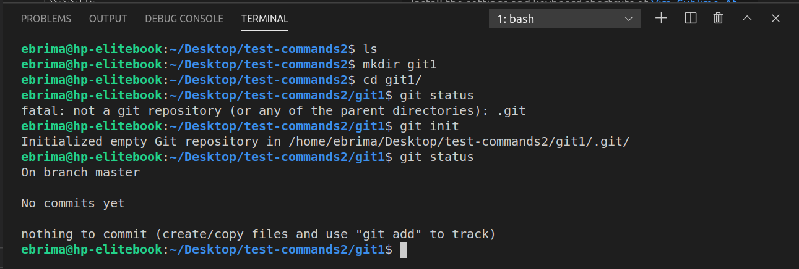


So, after you have initialize an empty folder to a git repo now is the time add some files and sub-folders. In the picture below you will see some changes before and after writing the **touch** command. 

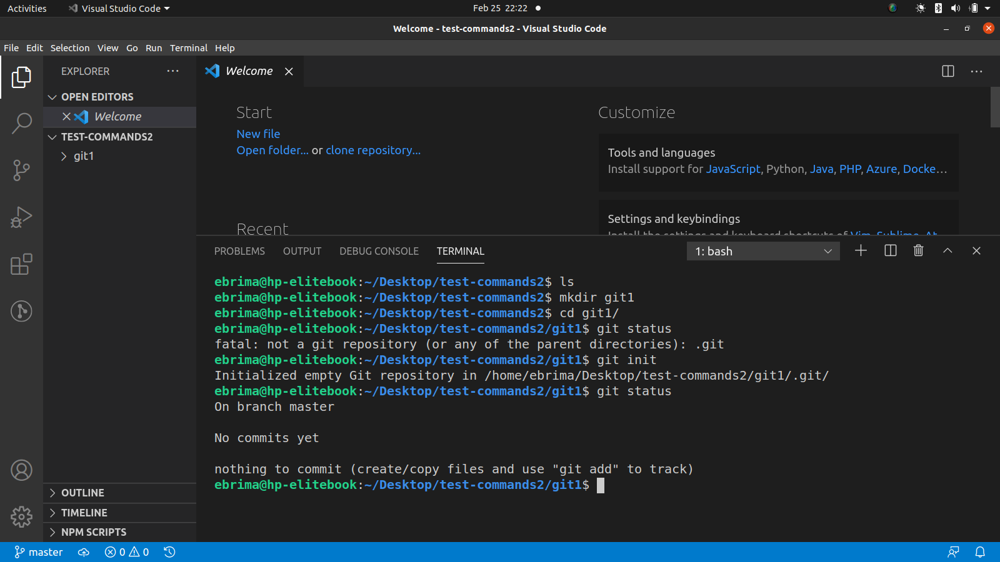


Let create a index.html file:

```bash
touch index.html
```


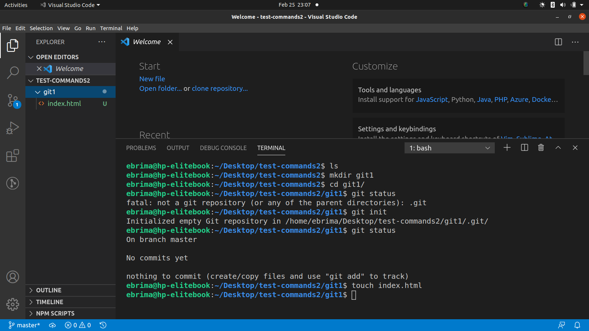


In VS Code you do not even need write `git status` to check, VS Code as a source control in build that will give you a hint if you add anything new to your git repo or remove anything from  your git repo. As you can see 1 in the left side in the picture above actually that's the source control task bar the number depends on the amount of changes you made.  With the help of the git extension we install earlier these is very helpful.


So the same way of adding/ stages your change, commit and push mentioned earlier.

See the screen-cast below: 

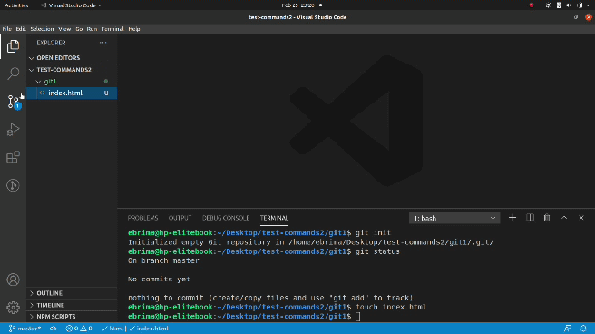


#### Initialize a Folder with files as a Git Repo

Now lets create a new folder in our computer and put in some files and sub-folders with a file after we `git init`and see the difference

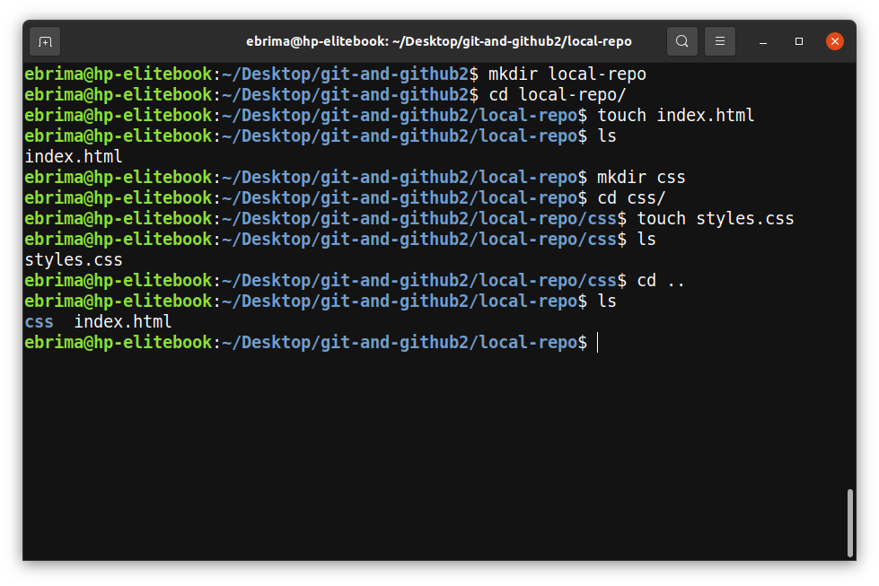

We  have create directory called local-repo in it create index.html file and a css folder in it a styles.css file using command we discussed in the earlier section.

Let's see how `git status` will bring:

```bash
git status
```


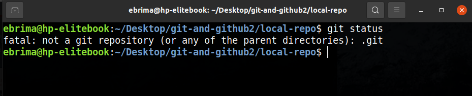


A fatal error is simply because we do not initialize our local-repo as a git repo. so, in the next Screen-shot we will `git init` our local-repo 

```bash
git init
```


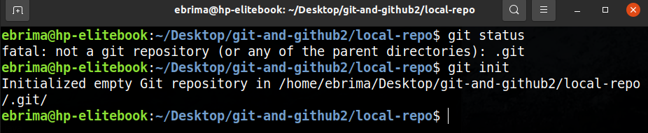


After we have initialized this folder let check the status of our new git repo. Remember added some contents to it earlier and what git those; is that it track the changes in our files(git repository)

```bash
git status
```


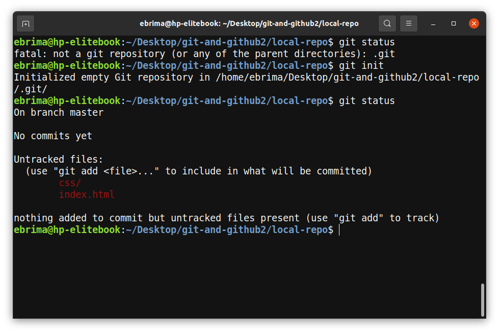


Now lets add only index.html file, we can also add all the files and folders once.

```bash
git add index.html
```

To added everything 

```bash
git add .
```


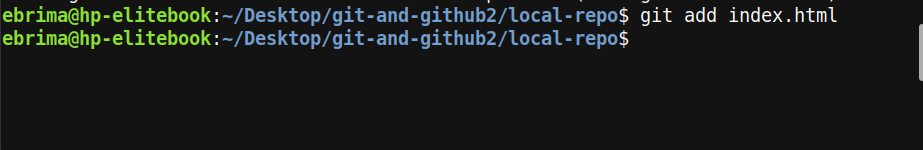


After adding our html file is a good time to check what changes git tracks 

```bash
git status
```


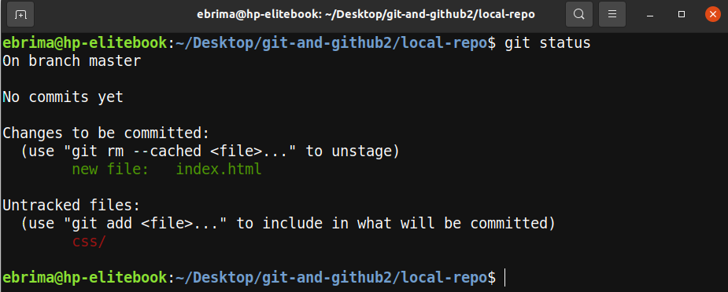


All we see is a green message new file: index.html and the other in red color that is the untracked files and that is the css folder with a styles.css file. We can used the same we added the html file 


Next let move on to committing these change we just made. We can also commit after every git add, if you want you make a commit for the index.html file and after when you add the untracked files you also make a commit, but here i will just make one commit for two changes i added.

I will add the css folder with styles.css file 

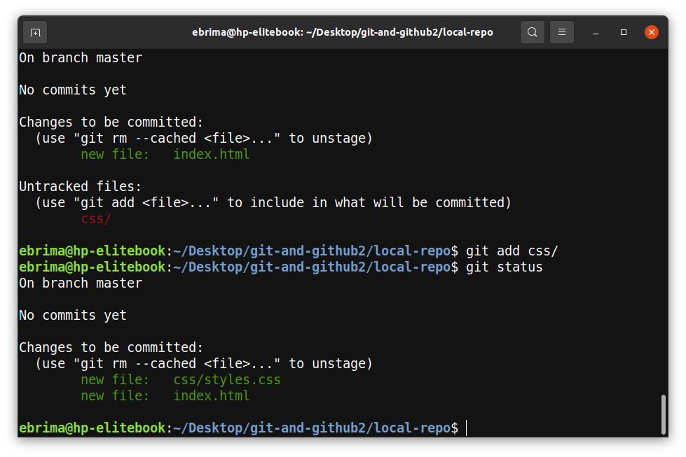

The easiest and the basic way to commit in terminal  is to write the commit command and provide -m flag and also the commit message in double quote. If you fail to provide a -m flag with commit message in quote it will open up vim which is a terminal base text editor or throw you error depending on the Os you're running and whether you installed vim or not. Vim is terminal base text editor and it's beyond the scope of the course.


```bash
git commit -m "Added markup and initial styles"
```

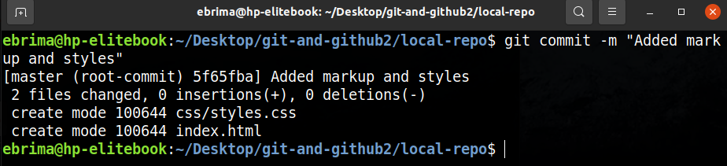


Like i said earlier is totally different creating a repo on Github and in our local machine, despite the route are almost the same. Creating a local repo doesn't stop from going to Github and create a repo like we first did. We have to go to Github and create new repo make we give it the same name as *local-repo* this time no need for us to check the add a README file because are not going to clone it down instead we will merge it with our existing local git repo.

Create new repo and give it the same exact name:

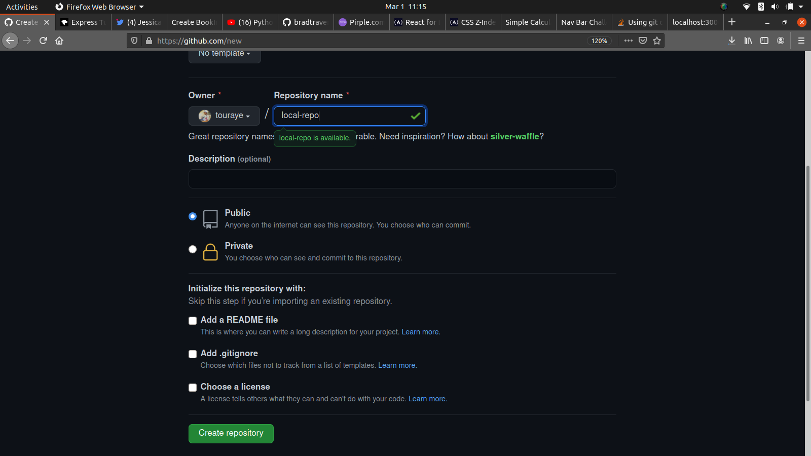


After creating a github repo a page below will show up and in this page we will copy a command and paste it in the terminal. The repo we just created on github is a remote repo and the one we created earlier a local repo and this two has no connection so we have to make them talk to each other. 

This the only command we need. Your github name will come github.com/ then the name of your repo

```bash
git remote add origin https://github.com/touraye/local-repo.git
```


> 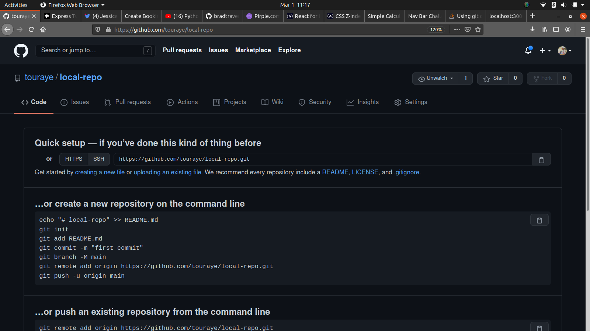


After coping the command show above we have to go to our terminal and past that in and hit on enter. The remote is set to origin

```bash
git remote
```


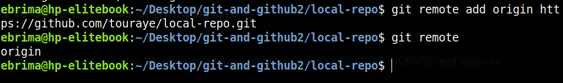


Now we have to push our code to Github. Pushing a local repo to Github is totally different from pushing a repo you create on Github and clone it down. In the screen-shot below after writing git push and enter you will see a fatal error and this is a hint git sent and provide a solution. You copy it or type it in the terminal and after you hit on enter, enter your credentials and your code will be push to github.

```bash
git push
git push --set-upstream origin master
```


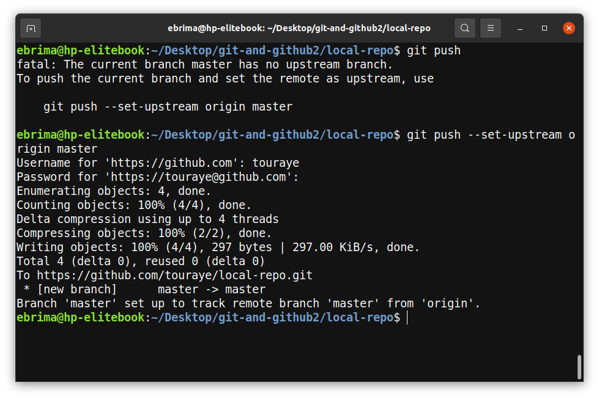


Finally, we have to confirm and we need to go on to github and refresh the browser so that our changes will be loaded and see whether the contents we added to our git repo are showing on github. ::v:  


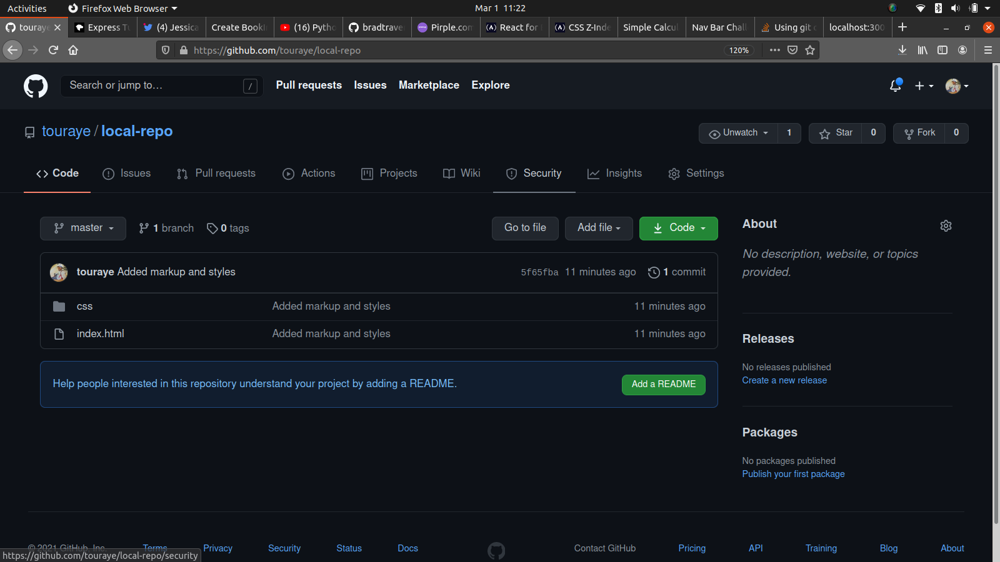


Wow! we have successful created an empty folder, add contents to it, initialized it as a git repo add/stages, commit our changes, go on to github create a remote repo, added our remote repo to our local repo and finally push our codes to github. Congratulation 


### Credits

[Git and Github for Absolute Beginner](https://thenewstack.io/tutorial-git-for-absolutely-everyone/)

[Amber Wilkie - What is github and what is git](https://www.freecodecamp.org/news/what-is-github-what-is-git-and-how-to-use-these-developer-tools/) 