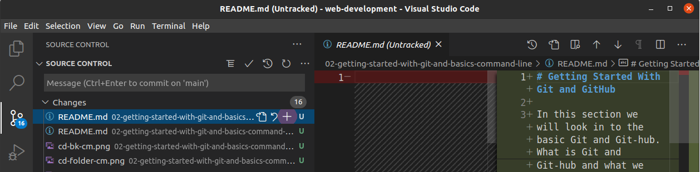
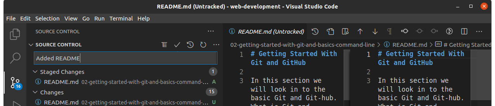

# Introduction to Git and Git-Hub and Basic Commands

This section will cover the basics of Git and Git-hub, What is Git and Git-hub, what are the tools needed, the terms (jargons) used and all that good stuffs, the environment we will be working with.

[TOC]

### What is Git:

Git is a free and open source version system control for software development. Git is the most commonly version control system in the development today, most programmer interact with git on a daily basics.

###  what is Version Control:

  The change to documents, computer programs, large website and other collections of information.

### What is Git-Hub:

  Git-hub is a could platform which software developers use for software development, version control and collaboration using Git. With Github many developers can be working on the same project and they don't even have to be together. Github helps in software hosing, bug tracking and continuous integration  etc. There are some other examples of version control like Bit-bucket, Git-lab, Perforce  [see more](www.hackernoon.com), but actually git-hub is most popular in the software development world. There are Over 50 millions developers are on git-hub.

### Installation:

First of all before we can start using Git on our machine we need to install git in our computer in other to be working it git. I'll show how to install git on windows, Mac and Linux.

**For Windows** you need to visit git [Download git for windows](www.git-scm.com) and download git which able you add Bash command tool that will able you write git commands on your PC, because power-shell on windows is well integrated for writing git commands. After you successfully install git open the Git-bash command line interface and type **git** **--version** this will show you the current version of git.

**For Mac OSX** you only need to install because mac itself is a UNIX base OS which means it has the Bash as a command line tool by default. There is packet manager for Mac called [homebrew](www.homebrew.com) which dose the wavy lifting for you. Install homebrew and you use the command below

```bash
brew install git 
// with out home brew
git install
//verify if git is install and this should show you the current version of git
git --version
```

**For Linux** you probably don't need that much. Linux is also a Unix base OS which means the default Bash is the default terminal. Open your terminal and type the following:

```bash
git install
//or use sudo
sudo apt-get install git
//verify if git is install and this should show you the current version of git
get --version
```

After successfully installing git in your operating system we also need to have Visual Studio Code running in your machine and with some extensions:

* Git lens
* Git project manager
* Git history

## Basic Terms:

* Create new Repository
* Clone
* Fork
* Stage or Add
* Commit
* Push
* Terminal or Command line (CLI)

**Create new Repository** (repo) is just a fancy way git-hub would refers to as a folder in our computer system, to create a repo on git-hub is like creating a remote folder in the could which you can add files or even sub folders to it and you also the power to make it public or private. private means you are the only one who can see and interact or the ones you give permission to and  public means anyone can see and have access to it. See the green button called new if your in github home page or on the far right on the nav bar there is plus icon with a drop down. If you click on create new repository a page will appear were you will fill the name of your repository which is a most and all are just optional but if you want to clone it down then you most check ✅ on Add a READMe which enables and that focus here. 


**Clone** is to have the instance of a remote repository (rope) on git-hub into your local machine just like how you would download a file from the Internet. Click on the green code button and copy the link. see the demo below:


After coping the link open you terminal write **git clone**  and paste [HTTPS ADDRESS]. make sure you're siting in the directory were you want to clone. See in my case in navigate to my main directory and you hit on ENTER


**Fork** is the way we copy and paste each others repository on git-hub. lets say you have a file or folder in a friends computer you will definitely have to slot in a USB and copy what is that you want and paste it in your computer, you can edit or modify that file, put it in a flash save back to your friends computer. Well, forking is the same concept here it  helps a lot in working on a large project, contributing to open source project.  If you fork any git-hub repo you have an instance your repos. See the fork button at right corner  click on it and dialog may appear for confirmation, click on yes/ok  


on successful go to your repository and check you shall see it and icon of a fork repo is different from your own repo


**Stag or Add** so lets continue on with the analogy of a file from a friend's computer. Now lets say the file an excel file and we needed to sum up the total, the min, average and  max. after going on that file we needed to save our changes or otherwise summing as no use. So,  if you are working with a git repository  you are doing the same thing, if you happens to add any new thing to it or remove anything from it git  repository git will automatically track those changes you made and now you need to add your change which you made to. In the screen-shot below see the highlighted blue color and a plus icon + with a purple shape(that's just for demo you won't any purple shape in yours), click on it to stage or add



**Commit** is like saying to a friend say hey buddy! i have made so and so changes to your file, just like giving a brief description on the changes you made. So, with git you should always commit the new changes you made to your repo before you push. See the text input field in it i read Added README and on top of that is a little check mark ☑ click on it to commit



**Push** is like uploading your new things which you added to your git repo you clone earlier from git-hub. If you don't push your changes and you happens to go to git-hub and check on your repo, you will release that there's nothing new to it simply because don't you push. See the purple shape in the bottom left of the screen-shot actually there are three icons, the first icon 🔁 is the icon you should click on to push a dialog will appear for confirmation click on OK and other icons arrow down  ￬ 0 and  ￪ 1 are just indicators for the changes you made and the more changes you make the more the figure will raise. Once you pushed the two arrows will disappear. 


**Terminal** or command line is the tool which we use mostly to working with git, and to download some other program  and also to create file and folder in a fly, changing navigation, deleting file and folder. Most of the thing we do with a mouse we can also do it on a terminal.


### Working with Terminal:

The terminal is more like the same how we interact with our file explore (GUI) graphical user interface, working with the terminal will speed up your dev work flow. You can do almost the same task in the terminal your GUI enables, you can create a file, add contents to a file, delete a file, copy and move a file and also you can create a folder and do all the files operations. 

some basics commands:

Creating a folder in your file system or explore. You most use your cursor or some keyboard shortcuts to create a folder, but here we are going to be doing all in the terminal. First, we would need to check somethings which is called your present working directory meaning the current location in your file system.

1. Present working directory 
2. List directory
3. How to create a folder
4. How to create a file
5. How to navigate between files and folders
6. How copy and move files within folders
7. How to delete a file or a folder

present working directory (pdw). This show the your current location in the terminal

 


**List directory (ls)** this will show you file structure, files and folders


**Create a new folder**. ***mkdir*** is command & folder name is *test-commands*


**Change directory**. ***cd*** is the command and *test-commands/* is the path to navigate to and ***cd ..*** will roll you back


**Create a new file**. ***touch*** is the command *test-file* & *index.html* are file 


**Move file from one location to another**. ***mv*** is the command *test01* is the file *css/* is the destination


**Remove or Delete** a folder rmdir is the command 


Delete a folder with a file


**Copy file** content to another file using the ***cp*** command, the file you're copping from and the file you're copping to. you can also open a markdown file in typora right from the terminal ***typora README.md*** and the ***cat*** command can help you to view a file with textual content in the terminal


**Copy a folder** in to a folder using ***cp and -r*** command, folder you copping and the folder you copping


There are more complex commands, but for the purpose of this course this are the few commands we may need. 


