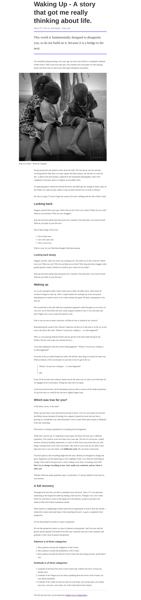

# A Journal Page

A Journal Page is a one page blog entry.

All the assets (text content and images) needed are in the assets folder.

## Steps

1. Create a Git Repository called **journal-page**, make it public

2. Clone it to the **web-projects** master folder

3. Open the (**journal-page**) in VS Code

4. In the root folder of  the **journal-page** via VS Code, create a **index.html** file

5. In the root folder of  the **journal-page** via VS Code, create a **images** folder

6. In the root folder of  the **journal-page** via VS Code, create a **css** folder

7. In the **css** folder via VS Code,  create a css file called **style.css**

8. From the project assets folder copy the **life** image and paste into the **images** folder of the project.

9.  Now, in the **index.html** file, generate the HTML skeleton and change the content of the `title` element to **Waking Up**

10. Link your **html** file with your **css** file using the link element

11. Now, within the body element, instead of using a `div` element use the `article` element to put all the codes in. The `article` element is most appropriate for things like this. Here is an example:

    ```html
    <!DOCTYPE html>
    <html lang="en">
    <head>
        <meta charset="UTF-8">
        <meta name="viewport" content="width=device-width, initial-scale=1.0">
        <title>Doc</title>
    </head>
    <body>
       <article>
    
       </article>
    </body>
    </html>
    ```

12. Now, now look at the design below and do all the codes within the article element.

13. Don't forget to apply the necessary classes where needed.

## The Design

Here is the design of the project, you are required  to turn this design into code (HTML and CSS). 

---



## Extra Work (Optional)

If you want to do more, you can check in the **extra-designs** folder for more designs and turn them into code. Make sure to create a new folder/repository for each one. This is not required, but it will help you up your HTML and CSS skills.